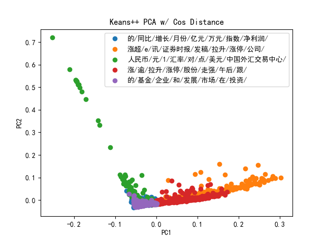

Project : Chinese financial news Kmeans++ clustering based on TFIDF vectorization
data source: https://figshare.com/articles/dataset/Chinese_Financial_News_Data/12666233

1. Required library and instruction to run:
    Zhon: for Chinese punctuation
    Jieba: for Chinese language segmentation
    Other regular: matplotlib for visualiztion, 
                  sklearn for PCA decomposition, 
                  and numpy, pandas

    data saved in article directory
    code and results in src directory

    Instructions: I didn't design this to take arguments, conversion is simple
                  besides, runing everthing takes FOREVER. 
                  
                  Nevertheless, if you are still interested:
                  
                  segmentation.py: modify segmentation(dirname,output_name) in the bottom
                                   dirname refers to the directory of the database, 
                                   note you have to put texts in dirname/Some_other_dir/texts
                                   output will be saved in dirname/output_name
                 
                  TF_IDF_vectorize.py: find driver() at the bottom
                                  TFIDF=Tf_Idf(dirname,filename,sample_num)
                                  first two arguments being the two you used for segmentation
                                  third argument being the sample_size in integer
                  
                  K_meansPP.py: find main() below and input a list of integers as k_vals
                                e.g. main([2,3,5,8,10])

2. segmentation
    Database includes: 18956 chinese financial news article in total, grouped in 2088 folders by news date
    article example:
    商务部新闻发言人沈丹阳17日在例行发布会上表示，今年外贸形势总体上还是比较严峻，但是我们仍然非常有信心来实现今年既定的外贸发展目标。而实现这一目标，首先要在“稳增长”方面下功夫。
    《证券日报》报道，沈丹阳表示，今年一季度外贸进出口增长了7.3%，这样一个相对低速的增长是在多种因素相互叠加的作用下出现的。
    沈丹阳表示，外贸发展面临的国内外环境仍然复杂严峻，形势仍然不容乐观。目前商务部和各级商务部门都已经积极行动起来，相信随着形势的发展和工作的深入，二季度外贸形势还会进一步好转，全年我们既定的外贸目标应该可以实现。全年外贸发展的主要目标是三句话九个字，即“稳增长、调结构、促平衡”，首先要在“稳增长”方面下功夫：
    第一是稳定政策。出口要稳定，首先必须政策稳定。企业最关心的出口退税政策、出口信用保险政策、贸易融资等金融支持政策，不仅要稳定，而且要加大支持的力度。国务院领导和商务部领导也多次强调，政策如果要做适度微调，也是鼓励性多于限制性的。
    所有具有进出口经营资格的企业都可以开展出口货物贸易项下的人民币结算业务，这个措施对于支持外贸有效应对人民币汇率波动的影响是有利的。沈丹阳表示，“虽然人民币汇率扩大交易的波动，企业有担心，这个办法就可以帮助企业了。此外，我们还会加快出口退税进度，加大对成套设备出口的信用保险支持，清理各种不合理的收费，有针对性地解决重点行业和中小企业的实际困难等。”
    第二是加强引导。要引导企业深度开拓新兴市场，引导企业在国外建立营销网络，引导企业培育自主品牌，引导加工贸易向产业链高端延伸，向中西部转移。
    第三是优化服务，在推动提高贸易便利化水平的同时，我们将对重点地区加强指导，对重点行业和企业加强服务。
    在“调结构”方面，沈丹阳表示，“我们实际上已经做了很多工作，去年取得了很好的成效，今年继续做。”
    “在“促平衡”方面，上个月国务院常务会议已经通过了一个文件，这个文件即将下发，题目叫做《关于加强进口促进对外贸易平衡发展的指导意见》，这个意见里有很多具体的政策措施，对今年进一步扩大进口、促进平衡将会有很好的指导作用。”沈丹阳表示。

    segmentation.py: take all articles in article folder and segment with jieba, puncuations removed but numbers kept
                 save results in article/segmented.txt
                 Note: I haven't add customrized dictionary, but it is beyond the scope of this project

    segmented example:
    商务部 新闻 发言人 沈 丹阳 17 日 在 例行 发布会 上 表示 今年 外贸 形势 总体 上 还是 比较 严峻 但是 我们 仍然 非常 有 信心 来 实现 今年 既定 的 外贸 发展 目标 而 实现 这一 目标 首先 要 在 稳 增长 方面 下功夫 证券日报 报道 沈 丹阳 表示 今年 一季度 外贸 进出口 增长 了 7.3% 这样 一个 相对 低速 的 增长 是 在 多种 因素 相互 叠加 的 作用 下 出现 的 沈 丹阳 表示 外贸 发展 面临 的 国内外 环境 仍然 复杂 严峻 形势 仍然 不容乐观 目前 商务部 和 各级 商务 部门 都 已经 积极行动 起来 相信 随着 形势 的 发展 和 工作 的 深入 二季度 外贸 形势 还会 进一步 好转 全年 我们 既定 的 外贸 目标 应该 可以 实现 全年 外贸 发展 的 主要 目标 是 三句话 九个 字 即 稳 增长 调 结构 促 平衡 首先 要 在 稳 增长 方面 下功夫 第一 是 稳定 政策 出口 要 稳定 首先 必须 政策 稳定 企业 最 关心 的 出口 退税 政策 出口 信用 保险 政策 贸易 融资 等 金融 支持 政策 不仅 要 稳定 而且 要 加大 支持 的 力度 国务院 领导 和 商务部 领导 也 多次 强调 政策 如果 要 做 适度 微调 也 是 鼓励性 多于 限制性 的 所有 具有 进出口 经营 资格 的 企业 都 可以 开展 出口 货物贸易 项下 的 人民币 结算 业务 这个 措施 对于 支持 外贸 有 效应 对 人民币 汇率 波动 的 影响 是 有利 的 沈 丹阳 表示 虽然 人民币 汇率 扩大 交易 的 波动 企业 有 担心 这个 办法 就 可以 帮助 企业 了 此外 我们 还会 加快 出口 退税 进度 加大 对 成套设备 出口 的 信用 保险 支持 清理 各种 不合理 的 收费 有 针对性 地 解决 重点 行业 和 中小企业 的 实际困难 等 第二 是 加强 引导 要 引导 企业 深度 开拓 新兴 市场 引导 企业 在 国外 建立 营销 网络 引导 企业 培育 自主 品牌 引导 加工 贸易 向 产业链 高端 延伸 向 中西部 转移 第三 是 优化 服务 在 推动 提高 贸易 便利化 水平 的 同时 我们 将 对 重点 地区 加强指导 对 重点 行业 和 企业 加强 服务 在 调 结构 方面 沈 丹阳 表示 我们 实际上 已经 做 了 很多 工作 去年 取得 了 很 好 的 成效 今年 继续 做 在 促 平衡 方面 上个月 国务院 常务会议 已经 通过 了 一个 文件 这个 文件 即将 下发 题目 叫做 关于 加强 进口 促进 对外贸易 平衡 发展 的 指导 意见 这个 意见 里 有 很多 具体 的 政策措施 对 今年 进一步 扩大 进口 促进 平衡 将会 有 很 好 的 指导作用 沈 丹阳 表示 

3. Code organization and implementation specifics

3A. TFIDF.py:(Term_frequency/Inverse_Document_Frequency)
    take segmented texts from article/segmented.txt and run TF-IDF calculation
    IDF is calculated based on all 18959 arcticles, 
    TF-IDF score is only calculated  within sample size (manually set as 4000)
    and I added penalty to punish long articles, so the TFIDF score is calculated by:

        TFIDF[key]=(TF_score/article_length)*IDF_score

    I manually write the TF-IDF code because i will need to extract cluster-wise
    topics later and I have no idea how to do that with sklearn
    besides, I find dataframe VERY SLOW when processing data with very high dimensionality.
    (324 features after PCA reduction with 0.9 variance, so imagine the dimensionality)
    
    outputs:
    IDF.csv and TFIDF.csv outputed and saved in src directory, 
    didn't upload TFIDF.csv, that is too HUGE, about 300mb 
    NOTE: change encoding to utf8 bom beforing checking it out, if you are intersted.

3B. KmeansPP.py:
    the kmeans++ algorithm and visualization
    1. pca dimension reduce with 0.9 variance, 324 features after reduction
    
    2. just regular Kmeans++ algorithm with cosine distance, I choose 100 as max-iteration time
       for performance, but they all converge before reaching that limit

       Cosine Distance= A*B / ||A||*||B||
       Kmeans++: improved version of Kmeans, select one centroid and iterate thru other point to select other
                 centroids based on distance
   
    2. I added topic_extract to extract significant topics within each group, calculated by
        simply add all TFIDF score of all articles with in one group up and multiply
        and sort them, print the 8 most significant words, this could be improved,
        as simply adding up all TFIDF score would benefit the common words that appear
        in all artciles, such as 的 and 和 (common Chinese words like "and" and "of")
    
    3. I manually selected 3,5,7,9 as K values

    4. outputs:
        f"fig_k={k}.png" are the visualization with PCA reduced to two features
        
        f"topics_only_k={k}.txt" only cluster topics with cluster size
        f"topics_simple_k={k}.txt" are the extracted topics followed by total num of article and 20 article names in the cluster
        f"topics_comprehensive_k={k}.txt" are the extracted topics followed by all article names in the cluster
                                        not related to this project, but could be useful for future improvemen

4. clusters with keywords :
    As mentioned above, the topic extraction algorithm needs to be improved
    so its better to check the article names in topics_simple_k={k}.txt or to check next section
    but I do not have time for that, besides, I believe the current extracted
    topics still could give you a sense of the clusters:(len refers to size of that cluster)

    when k=3:
    cluster topic:                        size:  
        1.涨超/e/讯/证券时报/发稿/涨停/拉升/公司/ (len=261) ；  
        2.涨/逾/拉升/股份/涨停/午后/走强/跟/      (len=401) ；  
        3.的/人民币/元/企业/亿元/基金/和/对/      (len=1338) ；  

    when k=5:
    cluster topic:                             size:  
        1. 的/同比/增长/月份/亿元/万元/指数/净利润/      len=434 ；   
        2. 涨超/e/讯/证券时报/发稿/拉升/涨停/公司/       len=233 ；  
        3. 人民币/元/1/汇率/对/点/美元/中国外汇交易中心/ len=229 ；  
        4. 涨/逾/拉升/涨停/股份/走强/午后/跟/            len=371 ；  
        5. 的/基金/企业/和/发展/市场/在/投资/            len=733 ；  
        
    when k=7
        cluster topic:                              size:  
        1. 逾/涨/跌/4%/7%/股份/5%/6%/                    len=204 ；  
        2. 的/基金/亿元/月份/增长/同比/指数/净利润/         len=431 ；     
        3. 涨超/e/讯/证券时报/发稿/拉升/钴/截至/           len=128 ；  
        4. 点/板块/的/5G/海南/涨停/涨幅/家/                len=360 ；  
        5. 人民币/元/1/汇率/对/中国外汇交易中心/美元/中间价/ len=85 ；  
        6. 拉升/涨停/e/跟/午后/异动/讯/直线/               len=269 ；  
        7. 的/企业/和/发展/改革/投资者/资本/要/            len=523 ；  

    
    when k=9:  
        cluster topic:
        1.人民币/元/1/汇率/对/中国外汇交易中心/美元/中间价/  len=91 ；  
        2.拉升/e/涨停/讯/股份/证券时报/概念股/跟/  len=215 ；  
        3.点/5G/的/海南/板块/家/科技/涨停  len=325 ；  
        4.逾/涨/4%/跌/7%/5%/黄金/6%  len=181 ；  
        5.的/基金/企业/投资者/和/市场/发展/改革/ len=568；   
        6.涨超/e/讯/证券/证券时报/发稿/拉升/券商/ len=130 ；  
        7. ST/水泥/万元/个股/A/核电/只/净流入/ len=115 ；  
        8.银行/常熟/招商银行/张家港/宁波/平安/股涨/发稿/ len=56；   
        9.同比/增长/的/月份/指数/增速/个/净利润/ len=319 ；  

5. Analysis with example k=9:
        
    cluster topics extracted and arcticle examples:

    cluster1: clearly about currency policy , especially US dollar and Chinese Yuan
        人民币/元/1/汇率/对/中国外汇交易中心/美元/中间价/  
        len=91  
        2014-06-04/4月份央行外汇占款仅增845亿元.txt  
        2014-09-17/[快讯]9月17日银行间外汇市场人民币汇率中间价.txt  
        2016-06-06/外汇流出压力放缓5月份外汇占款或环比持平.txt  
        2014-10-20/10月20日银行间外汇市场人民币汇率中间价.txt  
        2018-07-11/人民币对一篮子货币汇率昨日全线上涨.txt  
        2015-02-11/[快讯]2月11日银行间外汇市场人民币汇率中间价.txt  
        2019-08-07/央行将发行300亿元离岸央票.txt  
        2016-10-18/深港通开通渐近内地资金追捧准美元资产.txt  
        2016-08-05/人民币汇率改革一周年市场化成效初显.txt  
        2015-02-03/人民币即期汇率再度逼近跌停折价幅度创记录.txt  
        2014-07-30/[快讯]7月30日银行间外汇市场人民币汇率中间价.txt  
        2013-04-23/人民币汇率波幅有望扩大走势均衡之时成最佳时点.txt  
        2016-10-10/9月外储创新低人民币贬值压力或顺势释放.txt  
        2015-02-09/[快讯]2月9日银行间外汇市场人民币汇率中间价.txt  
        2014-03-19/人民币即期汇率破620或刺破房产泡沫拖累股市.txt  
        2013-04-26/公开市场近十周来首次实现净投放.txt  
        2014-09-23/央行今日14天正回购中标利率持平于350%.txt  
        2016-02-02/央行首次周一开展公开市场操作.txt  
        2015-01-06/[快讯]1月6日银行间外汇市场人民币汇率中间价.txt  
        2013-11-13/专家人民币汇率年底进五成大概率事件.txt  
    
    cluster2: about stock markets going up and reaching up limit
        拉升/e/涨停/讯/股份/证券时报/概念股/跟/  
        len=215  
        2019-10-10/区块链板块拉升聚龙股份涨停.txt  
        2020-06-30/金融科技概念盘中拉升京天利、银之杰涨停.txt  
        2017-10-25/汽车板块午后异动拉升天汽模涨逾6%.txt  
        2019-11-15/汽车板块异动拉升长城汽车涨近2%.txt  
        2019-05-16/军工股盘中拉升北斗、航母等题材领涨.txt  
        2018-08-23/动物疫苗概念股异动瑞普生物涨停.txt  
        2019-03-25/高送转概念午后拉升中光防雷直线涨停.txt  
        2018-04-13/半导体板块午后走强阿石创封板.txt  
        2019-04-03/游戏审批全面恢复网络游戏概念股掀起涨停潮.txt  
        2019-05-14/广电系个股普遍拉升天威视讯、广电网络涨停.txt  
        2019-07-16/钛金属概念强势天原集团涨停.txt  
        2019-11-12/区块链概念股拉升当代东方拉升封板.txt  
        2017-10-23/上海自贸区概念股再度走强华贸物流等多股涨停.txt  
        2017-11-03/360概念股回落明显天业股份等相继开板.txt  
        2017-12-01/网络安全概念股拉升走强拓尔思涨超8%.txt  
        2019-06-04/5G概念回落通信板块整体转跌.txt  
        2019-08-21/磷概念拉升澄星股份涨停.txt  
        2019-03-19/天然气板块午后拉升新疆浩源冲击涨停.txt  
        2018-01-19/部分区块链概念股拉升科蓝软件直线涨停.txt  
        2019-01-04/知识产权概念股异动光一科技直线涨停.txt  
    
    cluster3: about macro-economy analysis, as "大势分析"  
        点/5G/的/海南/板块/家/科技/涨停/ (topic extraction not performing well for this)
        len=325  
        2020-03-10/大势分析（2020年03月11日）.txt  
        2018-03-12/大势分析（2018年03月13日）.txt  
        2018-07-17/大势分析主力动向与投资机会（20.txt  
        2020-04-01/大势分析（2020年04月01日）.txt  
        2018-04-03/大势分析（2018年04月04日）向.txt  
        2017-09-22/5G概念持续活跃关注产业链股投资机会.txt  
        2018-02-23/大势分析（2018年02月26日）市.txt  
        2017-09-25/大势分析2017年09月26日）3.txt  
        2018-11-02/软件服务板块走势活跃托尔思科创信息等涨停.txt  
        2017-08-18/雄安概念股快速走强博天环境涨停.txt  
        2017-08-04/大势分析主力动向与投资机会（201.txt  
        2020-03-24/湖北板块发力拉升武汉解除离汉离鄂通道管控.txt  
        2018-01-30/大势分析（2018年01月31日）.txt  
        2018-05-10/大势分析（2018年05月10日）结构.txt  
        2020-01-03/种业股走势强劲转基因玉米拟获安全证书.txt  
        2020-03-10/半导体板块大幅拉升三星火灾叠加疫情影响存储器或再涨价.txt  
        2017-07-21/人工智能概念股快速走强科大智能涨超6%.txt  
        2015-11-25/机器人产业迎政策红包十三五末年产值将破1000亿元.txt  
        2017-12-13/大势分析（2017年12月14日）反.txt  
        2019-01-02/大势分析（2019年01月03日）继续.txt  
    
    cluster4: also about stock market going up  
        逾/涨/4%/跌/7%/5%/黄金/6%/  
        len=181   
        2019-01-15/酿酒板块持续攀升舍得酒业涨停.txt  
        2018-03-02/乡村振兴概念股午后活跃走强智慧农业涨5%.txt  
        2017-10-11/快递股早盘走强中通快递将调整快递价格.txt  
        2017-12-13/航空股涨幅扩大中国国航盘中一度涨停.txt  
        2019-08-26/军工板块午后异动中国应急涨6%.txt  
        2018-09-19/稀土永磁概念盘中走强鹏起科技涨逾6%.txt  
        2018-10-12/白酒股午后集体拉升贵州茅台涨逾3%.txt  
        2019-10-28/芯片股拉升长电科技涨逾7%.txt  
        2019-02-14/白酒板块早盘稳步上扬山西汾酒、水井坊大涨4%.txt  
        2019-09-27/白酒股快速下探金种子酒跌6%.txt  
        2017-07-13/稀土板块集体上攻北方稀土领涨.txt  
        2018-10-23/酿酒板块领跌洋河股份跌逾8%.txt  
        2018-09-03/5G板块杀跌中兴通讯盘中跌逾8%.txt  
        2019-08-29/深圳本地股卷土重来皇庭国际等多股涨停.txt  
        2018-09-12/锂电池板块午后异动亿纬锂能、超频三涨停.txt  
        2018-07-20/券商股午后发力沪指涨逾1%站上2800点.txt  
        2019-03-13/军工板块逆市走强中国卫星等涨逾9%.txt  
        2020-05-15/石墨烯概念股异动.txt  
        2019-09-24/白酒板块涨幅持续扩大金徽酒涨停.txt  
        2019-06-03/中兴通讯持续拉升涨逾8%大唐电信等5G概念股批量涨停.txt  
    
    cluster 5: on goverment investment policies,   
              if you look closely at the topics and article titles this does make sense  
        的/基金/企业/投资者/和/市场/发展/改革/  
        len=568   
        2012-11-16/证监会已出台的65件规则制度政策累积效应渐显.txt  
        2012-08-23/证监会拟允许券商代销金融产品品种不受限.txt  
        2016-02-23/两融余额8个月下跌幅度超六成.txt  
        2019-05-07/第二轮土地承包到期后发改委要求抓紧落实再延长30年政策.txt  
        2015-01-26/股权众筹最具互联网基因今年有望出台监管方案.txt  
        2014-09-05/沪港通四方协议签署交易证券范围明确.txt  
        2016-02-22/深交所规范公司债券发行等业务.txt  
        2016-12-28/证监会公司债券部多措并举开展投保工作.txt  
        2020-06-04/地摊概念再度爆发茂业商业等四连板多家公司提示风险.txt  
        2018-04-16/对外投融资基金发展正当时为一带一路建设持续提供资金融通.txt  
        2018-09-19/加码基建与新兴业务中国中冶(601618)正焕发新生机.txt  
        2014-03-25/发改委同意东莞等30城市建电子商务示范城市.txt  
        2017-07-24/由点到面A股市场对外开放全面开花.txt  
        2019-05-13/苏州升级版调控政策落地多城楼市或加码调控.txt  
        2019-02-15/国办切实降低小微企业和三农综合融资成本.txt  
        2020-03-02/券商板块震荡拉升关注政策呵护下券商投资价值.txt  
        2015-12-23/央行银行间债券市场推出绿色金融债券.txt  
        2016-11-11/深港通静等发令枪响预计将于短期内开通.txt  
        2018-01-26/深交所推进债券市场高质量发展助力国家战略.txt  
        2019-11-14/基建板块震荡上扬项目资本金下调逆周期政策持续加码.txt  

    cluster6: about brokers, as in 券商  
        涨超/e/讯/证券/证券时报/发稿/拉升/券商/  
        len=130   
        2019-04-02/券商股早盘集体拉升华创阳安涨停.txt  
        2019-01-18/婴童概念股午后拉升奥飞娱乐涨超6%.txt  
        2018-02-28/券商股午后直线拉升山西证券涨超6%.txt  
        2020-05-06/体育概念股盘中大幅拉升莱茵体育涨停.txt  
        2019-11-13/黄金概念早盘集体大涨.txt  
        2020-05-12/新冠检测板块走强昌红科技等涨停.txt  
        2019-10-22/网络安全概念股拉升任子行等涨停.txt  
        2019-03-22/旅游板块大涨中青旅涨超9%.txt  
        2017-11-27/券商概念股午后快速拉升西部证券涨超4%.txt  
        2020-05-13/特高压概念再度活跃保变电气涨停.txt  
        2019-12-10/无线耳机概念股再度拉升惠威科技涨停.txt  
        2019-11-08/汽车板块走强长安汽车涨超7%.txt  
        2019-01-03/券商股大幅走高方正证券率先涨停.txt  
        2019-03-06/互联金融概念持续走强大智慧12天10涨停.txt  
        2019-04-04/工业大麻概念早盘拉升紫鑫药业涨停.txt  
        2020-03-04/芯片股集体大跌兆易创新跌停.txt  
        2019-10-09/科技股午后普遍回暖光刻胶指数涨超3%.txt  
        2018-11-19/券商板块午后涨幅扩大天风证券等涨停.txt  
        2019-03-05/芯片板块集体拉升上海贝岭等多股涨停.txt  
        2019-04-04/民航发展基金征收减半航空股开盘大涨.txt  
    
    cluster7: also about stock market  
        ST/水泥/万元/个股/A/核电/只/净流入/  
        len=115   
        2017-01-12/国企改革主题热度不减14只概念股逆市吸金逾17亿元.txt  
        2016-11-07/有色金属10只个股年报净利润预计翻番.txt  
        2020-06-18/煤炭采选板块涨396%13只个股获194亿元资金净买入.txt  
        2019-11-19/水泥建材板块异动上峰水泥涨近4%.txt  
        2013-06-04/食品饮料两主线挖掘行业机遇.txt  
        2014-07-12/新一轮电改风起云涌四领域尽享政策红利.txt  
        2017-08-18/水泥建材板块走势活跃金隅股份涨超7%.txt  
        2018-05-04/地产股迎来久违上涨.txt  
        2017-03-21/核工业央企筹划重组烘热核电主题多机构称核电建设迎来高峰期.txt  
        2020-06-04/午后尾气处理板块走强机构称2021年市场空间约1000亿元.txt  
        2019-06-20/军工板块异动航天晨光直线涨停.txt  
        2019-06-21/核电板块再度走强兰石重装直线封板.txt  
        2018-01-02/水泥建材板块午后继续走强上峰水泥涨停.txt  
        2017-11-29/水泥股开盘走高上峰水泥涨停.txt  
        2020-04-27/ST板块个股走弱近20股跌停.txt  
        2016-09-05/近七成上市公司三季报预喜近64亿元大单转战业绩白马股.txt  
        2017-12-07/核电板块异动中国核建直线拉升涨停.txt  
        2018-03-08/次新股持续活跃中科信息等14股涨停.txt  
        2020-06-08/OLED板块早盘集体强势涨370%京东方Ａ涨停.txt  
        2020-05-25/体外诊断板块午后涨逾17%6只概念股吸金均超千万元.txt  
    
    clusrer8: about banks, for unknown reasons cities in Jiangsu and Zhejiang appear a lot  
        银行/常熟/招商银行/张家港/宁波/平安/股涨/发稿/  
        len=56   
        2018-01-19/银行股午后持续走强无锡银行等2股涨停.txt  
        2020-06-12/9只银行股逆市上涨估值低位引关注.txt  
        2017-11-17/银行股走势活跃招商银行涨超3%.txt  
        2018-01-15/房地产板块午后异动拉升.txt  
        2017-12-13/次新股午后继续走强勘设股份等多股涨停.txt  
        2018-10-10/次新股持续活跃锋龙股份5连板涨停.txt  
        2018-07-20/银行股集体拉升成都银行涨停招商银行涨近5%.txt  
        2018-02-28/保险、银行、券商等金融板块持续走弱.txt  
        2018-07-25/Facebook概念股大涨两股涨停.txt  
        2017-08-15/银行板块全线飘红江阴银行领涨.txt  
        2020-06-03/金融板块强势走高中国人寿涨逾4%.txt  
        2019-03-29/银行股走强招商银行等涨逾3%.txt  
        2020-07-03/澳新银行在一份报告中表示市场越来越相信放松对旅行和商务的.txt  
        2020-06-24/银行板块异动拉升张家港行涨停.txt  
        2017-06-02/银行板块活跃走强江苏银行涨逾3%.txt  
        2017-07-14/银行板块快速走强浦发银行涨超3%.txt  
        2017-06-19/近一个月5家民营银行密集开业深耕互联网+成差异发展突破.txt  
        2015-03-13/沪股通成交金额放大资金抢筹银行股.txt  
        2020-04-27/银行股持续走强青农商行涨停.txt  
        2019-10-14/银行股早盘持续走强青岛银行涨停.txt  
    
    cluster9: about revenues and ecnomocic index changes  
        同比/增长/的/月份/指数/增速/个/净利润/  
        len=319   
        2017-07-18/上半年GDP增速69%连续八个季度保持在合理区间.txt  
        2019-08-12/二季度房贷增速继续回落楼市降温痕迹隐现.txt  
        2018-06-11/5月份CPI同比涨幅与上月持平推高通胀因素正逐步退却.txt  
        2013-09-27/统计局三因素致8月工业企业利润环比增速加快.txt  
        2018-05-16/今日视点下阶段货币政策将施力结构性去杠杆.txt  
        2015-08-24/河北钢铁(000709)定增80亿布局高强度汽车板业务.txt  
        2017-12-15/零售板块再度走强中百集团涨停.txt  
        2012-07-21/央企前6月净利润同比下降16%.txt  
        2017-11-02/IMF年内第四次上调中国经济增长预期.txt  
        2019-12-04/化工股早盘表现较活跃龙星化工等涨停.txt  
        2016-11-03/前三季度房地产市场去库存与高地价并存.txt  
        2016-06-06/投资到位资金增速逐月回升固定资产投资后劲增强.txt  
        2017-10-24/9月份一线城市房价环比降02%同比涨幅连续12个月回落.txt  
        2013-09-05/美联储褐皮书7月初至8月底间美国经济呈现温和增长.txt  
        2012-10-29/广交会调查四季度仅两成企业订单增长.txt  
        2013-12-19/央行调查显示超3成企业认为宏观经济偏冷.txt  
        2014-12-02/2015年中国经济增速目标料下调到7%央行或需继续降息.txt  
        2013-10-24/价格回暖难撼煤炭行业寒冬期.txt  
        2015-10-20/前9月财政收入1144万亿同口径同比仅增54%.txt  
        2017-09-15/煤炭钢铁去产能力度加大有望提前完成年度目标.txt  
    

6. Evaluation with k-9:
   Pro:
   as mentioned above, I believe the clustering is pretty successful even dealing with one very specific form of articles- short financial articles 
   with 
        cluster1 about currenct policy, 
        cluster3 about macro-economic situstion report,
        cluster5 about government investment policies, 
        cluster6 about brokers
        cluster7 about banks
        cluster9 about economic index and revenue reports
    and cluster 2,4,8 about stock market.

   The bias in stock market clusters is simply because of the bias from the data, there is simply too many articles about stock market.
   
   Con and needs to be improved:
   1. the database is biased with too many articles about stock market, thus biased
   2. topic-extraction algorithm needs to be improved, especially in the example for the cluster 3
   3. manual dictionary needs to be added to better segment the word
   4. perhaps numbers could be eliminated to improve performancce
   5. detailed analysis on the content of the articles themselves should be conducted, but beyond the scope of the project

7. visualizations

   1. k=3
   
   2. k=5
   
   3. k=7
   
   4. k=9
   

